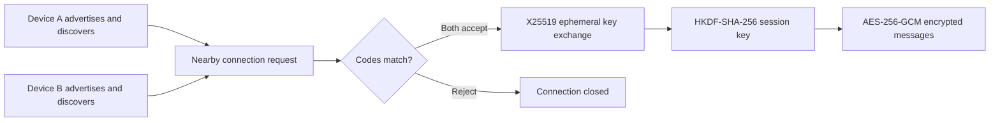

# BlueMesh

BlueMesh is an Android proof of concept for nearby text messaging without a backend or Internet connection. Devices advertise and discover one another locally, verify a shared connection code, and exchange messages directly.

The app uses [Google Nearby Connections](https://developers.google.com/nearby/connections/overview) through Flutter. Nearby Connections selects Bluetooth, BLE, or Wi-Fi as the underlying transport according to device availability.

> This repository demonstrates local peer-to-peer communication. It is not intended to replace a production messenger.

## Demo scope

- Continuous advertising and discovery of nearby Android devices.
- Many-to-many `P2P_CLUSTER` topology for small text payloads.
- Explicit approval on both devices using the authentication token.
- Ephemeral X25519 key agreement with HKDF-SHA-256 key derivation.
- Application-layer authenticated encryption with AES-256-GCM.
- One-to-one conversations with delivery attempt state.
- Runtime permission handling for Android 6 through Android 16.
- No account, cloud service, mobile data, or shared Wi-Fi network required.

## How it works



The UI and message model depend on a small `NearbyTransport` interface. `NearbyConnectionsTransport` is the Android adapter, so another transport such as native Wi-Fi Direct can be evaluated later without coupling it to the chat screens.

## Run the proof of concept

Requirements:

- Two physical Android devices with Google Play services.
- Bluetooth, Wi-Fi, and Location services enabled.
- Flutter compatible with Dart `3.13` or newer.

```bash
flutter pub get
flutter run
```

Install and open the app on both phones:

1. Give each device a different local name.
2. Tap **Enter the local network** and grant the requested nearby-device permissions.
3. Select the other device and tap **Connect**.
4. Compare the authentication code shown on both phones, then accept on both.
5. Open the chat and exchange messages. Airplane mode can be enabled as long as Bluetooth and Wi-Fi remain available.

Nearby Connections does not expose its radio path in the Android emulator, so physical interoperability must be verified on real hardware.

## Emulator demo

The demo transport creates two virtual peers while using the same message model and real cryptographic implementation as the Android transport:

```bash
flutter devices
flutter run -d <emulator-id> --dart-define=DEMO_MODE=true
```

Connect to **Ana · Demo**, verify the displayed code, accept the connection, and send a message. The virtual peer decrypts the AES-GCM payload and returns an encrypted response. Normal builds omit `DEMO_MODE` and use Nearby Connections.

## Security model

- Google Nearby Connections provides an encrypted peer-to-peer link.
- BlueMesh adds an application-layer session key derived independently for every connection.
- Only ephemeral X25519 public keys are exchanged before the secure channel is ready.
- Message text, author, timestamp, and identifier stay inside the AES-256-GCM envelope.
- AES-GCM rejects payloads that were modified in transit.
- Users must compare the Nearby authentication code on both devices. Skipping that check would leave the connection open to an active intermediary.
- Session keys exist only in memory and are destroyed when the endpoint disconnects.

This POC does not provide persistent cryptographic identities, account recovery, key backup, or protection for a compromised phone.

## Project structure

```text
lib/
├── main.dart
└── src/
    ├── chat_controller.dart
    ├── models/
    ├── nearby/
    │   ├── nearby_transport.dart
    │   └── nearby_connections_transport.dart
    └── screens/
```

## Current limitations

- Android only; the selected plugin does not implement iOS.
- Messages live in memory and disappear when the app closes.
- Discovery is designed for an active foreground demonstration.
- Text messages only; file and media payloads are outside this POC.
- Delivery status means the payload was handed to the Nearby API. There is no application-level read receipt.
- Physical-device interoperability still needs to be validated across Android versions and manufacturers.

## Possible next experiments

1. Add message acknowledgements and local persistence.
2. Compare Nearby Connections with a native Wi-Fi Direct transport.
3. Add store-and-forward relaying with message IDs and loop prevention.
4. Add persistent device identities and signed prekeys.
5. Add an iOS adapter based on Multipeer Connectivity.

## Validation

```bash
flutter analyze
flutter test
flutter test integration_test/demo_flow_test.dart \
  -d <emulator-id> \
  --dart-define=DEMO_MODE=true
```

---

## Español

BlueMesh es una prueba de concepto de mensajería cercana para Android. Dos o más teléfonos pueden encontrarse y enviarse texto cifrado directamente mediante Bluetooth, BLE o Wi-Fi, sin servidor y sin acceso a Internet. Antes de conectarse, ambos usuarios comparan un código de autenticación y aceptan la solicitud. Después, cada conexión usa claves efímeras X25519 y mensajes autenticados con AES-256-GCM.

La demostración requiere dispositivos Android físicos; el emulador no implementa el transporte de Nearby Connections.
