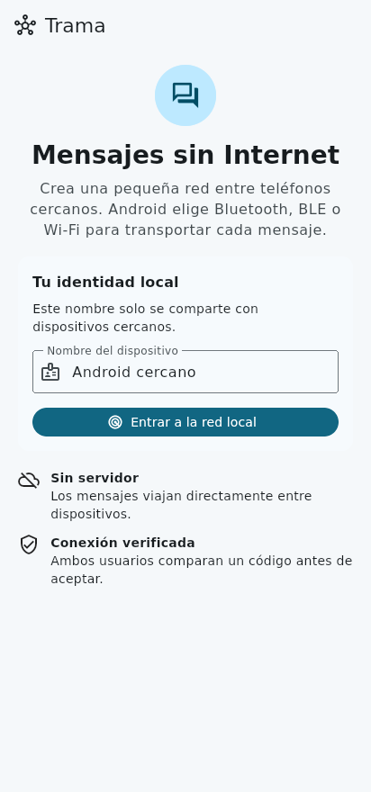
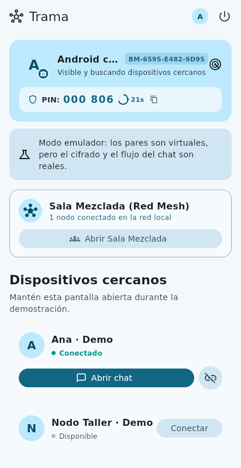
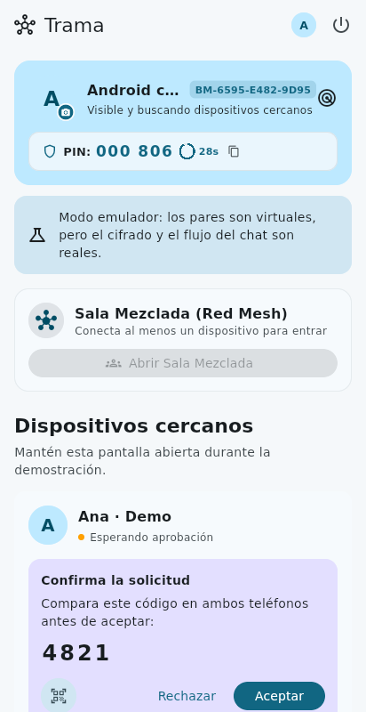
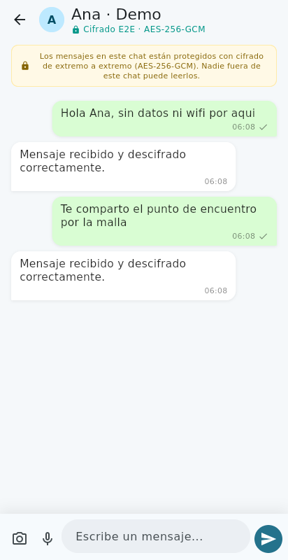
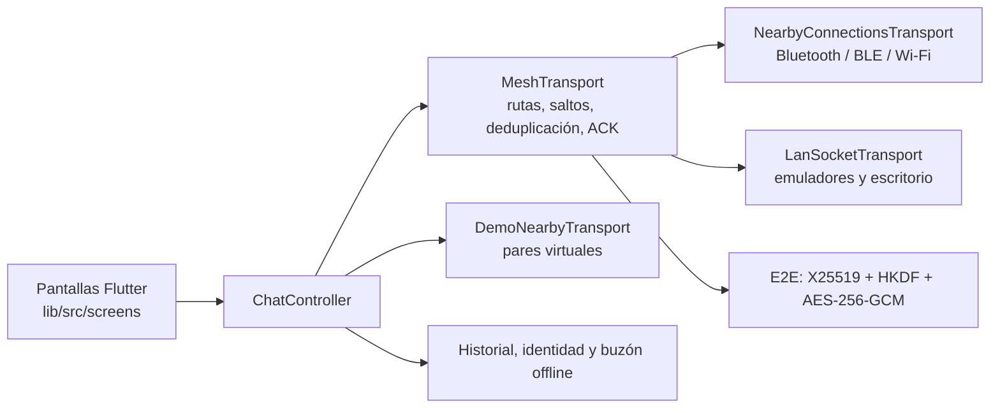

<p align="center">
  
</p>

<h1 align="center">Trama</h1>

<p align="center">
  Mensajería sin Internet entre teléfonos cercanos: Bluetooth, BLE y Wi-Fi,<br>
  cifrado de extremo a extremo y retransmisión en malla a través de otros dispositivos.
</p>

<p align="center">
  <a href="https://github.com/v1dalhernan/message_blue/actions/workflows/ci.yml"></a>
  <a href="https://github.com/v1dalhernan/message_blue/releases/latest"></a>
  
  
  <a href="LICENSE"></a>
</p>

> **English summary.** Trama is an offline, peer-to-peer messenger built with Flutter. Phones discover each other over Google Nearby Connections (Bluetooth / BLE / Wi-Fi Direct), verify each link with a short code, and form a multi-hop mesh: a private chat from A to C can travel through B without B being able to read it (X25519 + HKDF + AES-256-GCM envelopes). It supports text, photos and voice notes, message edits, read receipts, store-and-forward delivery, local history and system notifications. 26 automated tests cover routing, encryption, deduplication, verification and reconnection.

## Capturas

| Inicio | Dispositivos cercanos | Verificación del enlace | Chat cifrado |
| :---: | :---: | :---: | :---: |
|  |  |  |  |

Capturas tomadas del modo demostración (`DEMO_MODE`), que simula pares virtuales pero ejecuta el cifrado y el flujo de chat reales.

## Qué resuelve

En conciertos, zonas rurales, cortes de red o situaciones de emergencia no siempre hay cobertura. Trama permite que teléfonos cercanos se comuniquen directamente, sin servidores ni cuentas, y que los mensajes lleguen más lejos saltando por otros teléfonos de la red.

## Funcionalidades

- **Malla multi-salto.** Direcciones estables derivadas de claves públicas, anuncios de rutas cada 15 s, rutas de hasta seis nodos, límite de saltos, deduplicación, confirmación del destino y reintentos.
- **Chats privados cifrados de extremo a extremo.** Un chat de A a C puede cruzar B: B retransmite el sobre cifrado pero no puede leerlo ni lo muestra.
- **Verificación de enlaces.** Código de conexión comparado en ambas pantallas y PIN temporal rotativo (HMAC, ventana de 30 s) validado por el teléfono que lo muestra.
- **Multimedia.** Texto, fotos y notas de voz, con fragmentación en paquetes menores de 32 KiB para respetar el límite de Nearby.
- **Experiencia de mensajería completa.** Edición de mensajes, confirmaciones de lectura, avatares sincronizados, sala pública de la malla y notificaciones del sistema solo para los chats que no estás viendo.
- **Entrega diferida.** Los mensajes pendientes se guardan y se reenvían cuando vuelve a existir una ruta verificada.
- **Persistencia local.** Historial, identidad y pendientes se conservan al cerrar la app o salir de la red.
- **Servicio en primer plano en Android** para mantener la malla activa con la app en segundo plano.

## Arquitectura



Todos los transportes implementan la misma interfaz `NearbyTransport`, lo que permite probar la lógica de malla con enlaces simulados y cambiar la radio real por TCP o por una demo sin tocar la interfaz.

La entrada es `lib/main.dart`, que usa `lib/src/screens/`, `lib/src/chat_controller.dart` y `lib/src/nearby/mesh_transport.dart`.

### Stack

Flutter / Dart 3.13, [`nearby_connections`](https://pub.dev/packages/nearby_connections), [`cryptography`](https://pub.dev/packages/cryptography), `flutter_local_notifications`, `record` y `audioplayers`, `image_picker`, `mobile_scanner` y `qr_flutter`. Servicio nativo Android en Kotlin (`MeshNetworkService`).

## Probarlo

### Descargar el APK

En [Releases](https://github.com/v1dalhernan/message_blue/releases/latest) se publican dos APK por versión:

- `trama-demo-vX.Y.Z.apk`: funciona en un solo teléfono o emulador, con pares virtuales. Ideal para ver la app rápidamente.
- `trama-vX.Y.Z.apk`: versión real con Nearby. Instálala en dos o más teléfonos Android con Google Play Services y activa Bluetooth, Wi-Fi y ubicación. No necesita Internet.

### Compilar desde el código

```sh
flutter pub get

# Teléfonos Android físicos (Nearby)
flutter run

# Demo en un solo dispositivo
flutter run --dart-define=DEMO_MODE=true

# Emuladores / escritorio mediante un hub LAN de desarrollo
dart run bin/lan_hub.dart
flutter run -d <device-id> --dart-define=LAN_MODE=true
```

El hub LAN es una herramienta de desarrollo de confianza: no debe exponerse a Internet.

## Calidad

```sh
flutter analyze
flutter test
```

26 pruebas automatizadas, ejecutadas en cada push por [GitHub Actions](.github/workflows/ci.yml). Incluyen una topología A-B-C sin enlace A-C, recepción cifrada, rechazo de texto cifrado manipulado, PIN incorrecto, verificación bilateral, multimedia, ediciones, lectura, reconexión, deduplicación, visibilidad de notificaciones, fragmentación y restauración local.

## Límites conocidos

Este proyecto es una prueba de concepto avanzada, no un producto publicado en tiendas. Detalles en [validación y límites](docs/VALIDATION.md):

- Las claves de identidad son persistentes: no hay secreto hacia adelante.
- El historial se guarda en el almacenamiento privado de la app, sin cifrado adicional del archivo.
- iOS y macOS usan el transporte LAN de desarrollo; la malla Bluetooth de producción es solo Android.
- Falta la validación física con tres teléfonos Android; los emuladores no reproducen la radio Nearby.
- Android no garantiza recepción tras forzar la detención de la app o si el sistema termina el proceso.

## Publicar una versión

```sh
git tag v1.0.0
git push origin v1.0.0
```

El workflow [Release](.github/workflows/release.yml) ejecuta las pruebas, compila ambos APK y los adjunta a una GitHub Release. Si se configuran los secretos `ANDROID_KEYSTORE_BASE64`, `ANDROID_KEYSTORE_PASSWORD`, `ANDROID_KEY_ALIAS` y `ANDROID_KEY_PASSWORD`, el APK se firma con esa clave; si no, con la clave de depuración.

## Autor

**Jhonathan Vidal** - [github.com/v1dalhernan](https://github.com/v1dalhernan)

## Licencia

[MIT](LICENSE)
