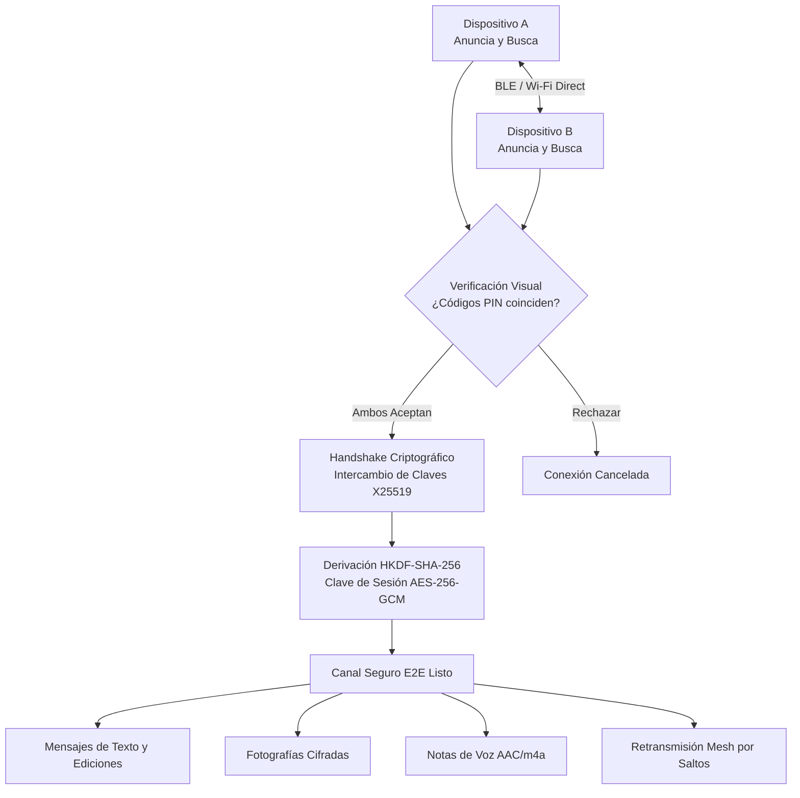

# BlueMesh

[](https://flutter.dev)
[](lib/src/nearby/nearby_transport.dart)
[](lib/src/nearby/secure_session.dart)

BlueMesh is an off-grid, peer-to-peer (P2P) local communication app for Android and desktop platforms. Devices discover each other locally, verify a shared authentication PIN, establish an end-to-end encrypted session, and exchange **text messages, photos, and voice notes**—with zero reliance on internet connectivity, mobile data, or central servers.

Under the hood, BlueMesh uses [Google Nearby Connections](https://developers.google.com/nearby/connections/overview) (selecting Bluetooth, BLE, or Wi-Fi Direct dynamically on physical Android devices), and provides a TCP socket relay transport for seamless multi-emulator development.

---

## ✨ Features

- **End-to-End Encryption (E2E):** Ephemeral X25519 (ECDH) key agreement, HKDF-SHA-256 derivation, and authenticated AES-256-GCM symmetric encryption for all messages and media.
- **Visual Authentication:** 4-digit token comparison prevents Man-in-the-Middle (MITM) attacks during pairing.
- **Rich Multimedia:**
  - 🎙️ **Voice Notes:** Record voice notes with live timer, transmit encrypted AAC/m4a audio, and play back with an interactive seek bar.
  - 📷 **Photos & Images:** Select from gallery or camera with automatic compression and full-screen zoom preview (`InteractiveViewer`).
  - ✏️ **Message Editing:** Edit sent messages in real time with live sync across peers and `(editado)` badges.
- **🌐 Sala Mezclada (Mesh Group Chat):** Multi-hop broadcast room where messages hop from peer to peer (up to 5 hops) with loop prevention and seen-ID deduplication.
- **💻 Multi-Emulator & Multiplatform Dev Mode:** Run `bin/lan_hub.dart` to simulate local radio links across multiple Android emulators and macOS desktop instances simultaneously.

---

## 📡 How It Works



---

## 🚀 Running the App

### Option 1: Multi-Emulator Testing (LAN Dev Mode)

Because standard Android emulators do not emulate physical BLE/Wi-Fi antennas between each other, BlueMesh includes a high-performance LAN socket transport:

1. **Start the local Dev Relay Hub** (on your Mac/PC host):
   ```bash
   dart run bin/lan_hub.dart
   ```
2. **Launch the first emulator:**
   ```bash
   flutter run -d Pixel_9_Pro_XL --dart-define=LAN_MODE=true
   ```
3. **Launch the second emulator (or macOS desktop):**
   ```bash
   flutter run -d Pixel_9_Pro_Fold --dart-define=LAN_MODE=true
   # or on desktop:
   flutter run -d macos
   ```
4. Enter a name on both devices, tap **Entrar a la red local**, connect, accept the PIN, and start chatting!

---

### Option 2: Physical Android Devices (Radio Transport)

Requirements:
- Two physical Android devices with Google Play services.
- Bluetooth, Wi-Fi, and Location services enabled.

```bash
flutter pub get
flutter run
```

1. Give each device a unique local name.
2. Tap **Entrar a la red local** and grant nearby permissions.
3. Tap **Conectar** on the discovered peer, compare the PIN, and accept.

---

### Option 3: Built-In Virtual Demo Mode

To test UI and cryptography in a single emulator without external peers:

```bash
flutter run -d <emulator-id> --dart-define=DEMO_MODE=true
```
Connect to **Ana · Demo** and test the encrypted round-trip response.

---

## 🛡️ Security Architecture

| Layer | Implementation | Purpose |
| :--- | :--- | :--- |
| **Transport Layer** | Google Nearby Connections / LanSocket | Local P2P physical radio link or socket bridge |
| **Key Agreement** | X25519 (ECDH) | Generates ephemeral key pairs per connection |
| **Key Derivation** | HKDF-SHA-256 | Derives a 256-bit symmetric session key |
| **Data Encryption** | AES-256-GCM | Authenticated symmetric encryption with random nonces |
| **Integrity** | AES-GCM MAC Tag | Modifying payloads in transit triggers rejection |
| **Authentication** | 4-Digit Display PIN | User verifies visual code before channel opens |

---

## 📁 Project Structure

```text
lib/
├── main.dart                               # Entry point and transport selector
└── src/
    ├── chat_controller.dart                # State manager, media handling, and mesh relay
    ├── models/
    │   ├── chat_message.dart               # Multimedia model (text, image, audio, edit)
    │   └── nearby_peer.dart                # Peer connection state model
    ├── nearby/
    │   ├── nearby_transport.dart           # Transport interface abstraction
    │   ├── nearby_connections_transport.dart # Android Google Nearby Connections adapter
    │   ├── lan_socket_transport.dart       # TCP socket transport for multi-emulator testing
    │   ├── demo_nearby_transport.dart      # In-memory virtual peer mock
    │   ├── secure_session.dart             # X25519 + HKDF + AES-256-GCM cryptography
    │   └── nearby_event.dart               # Reactive event definitions
    └── screens/
        ├── home_page.dart                  # Discovery screen and mesh status
        ├── peer_chat_page.dart             # 1-on-1 chat with voice player and image viewer
        └── mesh_group_chat_page.dart       # Group Mesh room (Sala Mezclada)
bin/
└── lan_hub.dart                            # Local TCP Dev Hub for emulator bridging
```

---

## 🧪 Automated Testing

```bash
# Static analysis (0 warnings, 0 errors)
flutter analyze

# Unit & Widget tests (13 tests passing)
flutter test

# End-to-end integration test
flutter test integration_test/demo_flow_test.dart -d macos
```

---

## 🇪🇸 Resumen en Español

**BlueMesh** es una aplicación de mensajería *peer-to-peer (P2P)* sin servidores ni conexión a Internet. Permite conectar dispositivos cercanos mediante Bluetooth, BLE o Wi-Fi Direct, verificando códigos de autenticación antes de abrir un canal seguro cifrado de extremo a extremo con **X25519** y **AES-256-GCM**.

### Nuevas características implementadas:
- 🎙️ **Notas de voz:** Grabación interactiva con temporizador, compresión AAC y reproductor integrado con barra de progreso.
- 📷 **Fotos e imágenes:** Selección desde cámara o galería con visor a pantalla completa interactivo con zoom.
- ✏️ **Edición de mensajes:** Edición en tiempo real manteniendo presionado un mensaje propio.
- 🌐 **Sala Mezclada (Red Mesh):** Chat grupal descentralizado con retransmisión por saltos (*multi-hop relay*) y prevención de bucles.
- 💻 **Pruebas en emuladores:** Hub de retransmisión local en `bin/lan_hub.dart` para conectar múltiples emuladores en tu computadora.
